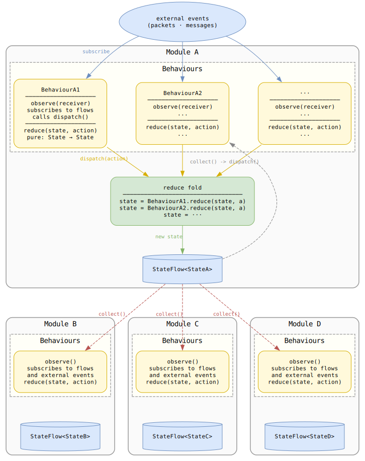

# SlimeVR Server Architecture

This document explains how the server is structured, why it's structured that way, and how to extend it correctly.

---

## Mental Model

Every significant part of the server a tracker, a UDP connection, a SolarXR session, a config file is a **module**. Every module is a list of behaviours sharing one context:



That's the entire system. Everything else is an application of this pattern.

---

## Why This Pattern

The server handles many concurrent connections, each with independent state that many other components need to observe. A shared mutable object works fine until two coroutines update it at the same time, or you need to know *when* something changed, or you want to add a feature without touching existing code.

The reducer pattern solves all three:

- **Thread safety**: `StateFlow.update` is atomic. Concurrent dispatches serialize without locks.
- **Observability**: `context.state` is a hot `StateFlow` it always holds the current value and any code can `collect` it and react to changes without being coupled to the producer.
- **Extensibility**: adding a feature means adding a `Behaviour` to a list. Nothing else changes.

The cost is that you cannot mutate state directly. Everything goes through `dispatch`. That constraint is the point.

---

## The Context

`Context<S, A>` (`context/context.kt`) holds two things: the current state as a `StateFlow<S>`, and the coroutine scope that defines this module's lifetime.

```kotlin
class Context<S, in A>(
    val state: StateFlow<S>,
    val scope: CoroutineScope,
) {
    fun dispatch(action: A)
    fun dispatchAll(actions: List<A>)
}
```

`Context.create` takes an initial state and a list of behaviours. On each `dispatch`, it folds every behaviour's `reduce` over the current state in order and publishes the result. Behaviours that don't care about an action return the state unchanged.

`dispatchAll(actions)` applies a list of actions in one atomic `StateFlow.update`. Use it when you need multiple state changes to be visible as one intermediate states are never published, so no observer fires between them.

---

## Behaviours

A behaviour is one feature of a module. It has two methods, both optional:

```kotlin
interface Behaviour<S, A, C> {
    fun reduce(state: S, action: A): S = state   // pure, no side effects
    fun observe(receiver: C) {}                   // side effects go here
}
```

`reduce` is a pure function it cannot launch coroutines, call external services, or read from a clock. It just maps `(state, action) → state`.

`observe` is called once at construction, after the context exists. This is where you launch coroutines, subscribe to flows, register event listeners. All coroutines launched here should use `receiver.context.scope` so they die when the module dies no manual cleanup, no leaks.

**Why behaviours instead of methods on the module class?**

The natural alternative is one class with methods for each feature ping handling, handshake logic, sensor registration, timeout detection, all in the same file. That works until the class has 20 features and every change has global blast radius. Behaviours make the feature list explicit: you read `create()`, you see exactly what the module does. Adding or removing a feature is one line in that list, touching nothing else.

**Why `observe` is separate from `reduce`:**

`reduce` must stay pure so state transitions are testable and predictable. Side effects in `observe` are isolated a behaviour that logs packets doesn't affect state, a behaviour that saves config doesn't affect packet handling.

### Scoping Behaviours to Module Lifetime

Every behaviour's coroutines run inside `receiver.context.scope`. When a UDP connection drops, its scope is cancelled, which cancels every coroutine every behaviour launched for that connection. No teardown code needed anywhere.

This is why `observe` receives the module (or context) rather than taking a raw `CoroutineScope` parameter it enforces that behaviours cannot outlive their module.

### Stateless vs. Stateful Behaviours

Behaviours with no constructor dependencies are `object`s singletons, zero allocation:

```kotlin
object PacketBehaviour : UDPConnectionBehaviour { ... }
```

Behaviours that need external services are `class`es, constructed at the call site:

```kotlin
class TrackerConfigBehaviour(
    private val settings: Settings,
    private val hardwareId: String,
) : TrackerBehaviour { ... }
```

When a behaviour is conditional (depends on a nullable service), use `buildList`:

```kotlin
val behaviours: List<MyBehaviour> = buildList {
    add(AlwaysPresentBehaviour)
    optionalService?.let { add(OptionalServiceBehaviour(it)) }
}
```

### The Receiver Type

The type parameter `C` controls what `observe` receives. For simple modules where behaviours only need to dispatch or subscribe to state, `C` is the context itself. For modules where behaviours also need to call methods (send bytes, emit events), `C` is the module class:

```kotlin
// behaviours only dispatch/observe state
typealias GlobalConfigBehaviour = Behaviour<GlobalConfigState, GlobalConfigActions, GlobalConfigContext>

// behaviours also call receiver.send(), receiver.packetEvents.on<T>(...)
typealias UDPConnectionBehaviour = Behaviour<UDPConnectionState, UDPConnectionActions, UDPConnection>
```

### File Layout

Behaviours live in a `behaviours.kt` file in the same package as the module, separate from the module class itself:

```
tracker/
├── module.kt       ← Tracker class, TrackerState, TrackerActions, typealiases
├── behaviours.kt   ← TrackerBasicBehaviour, TrackerTPSBehaviour, ...
└── config.kt       ← TrackerConfigBehaviour (its own file distinct concern)
```

`module.kt` is the standard name for the file containing the module class, state, actions, and typealiases. `behaviours.kt` holds the implementations. For modules with many distinct feature areas, split behaviours by feature instead of one file `solarxr/` uses this: `datafeed.kt`, `firmware.kt`, `provisioning.kt`, etc. each live alongside `module.kt`.

---

## Actions

Actions are `sealed interface`s. This matters because the compiler enforces exhaustive `when` in reducers you cannot forget to handle a new action type. Named actions also mean you can grep for all places a specific transition can occur.

```kotlin
sealed interface UDPConnectionActions {
    data class Handshake(val deviceId: Int) : UDPConnectionActions
    data class LastPacket(val packetNum: Long?, val time: Long) : UDPConnectionActions
    data object Disconnected : UDPConnectionActions
}
```

The choice between a flexible `Update` action and a named action is about who else needs to react:

- **`Update`** when only the caller cares about the change. It carries a lambda that transforms state directly. No other behaviour pattern-matches it, so there's no coupling.
- **Named action** when other behaviours need to react to this specific event. `Handshake` in `UDPConnectionActions` signals to multiple behaviours that a connection is now established; each one matches it independently.

```kotlin
// Nothing else needs to react use Update
tracker.context.dispatch(TrackerActions.Update { copy(tps = newTps) })

// Multiple behaviours react to this use a named action
connection.context.dispatch(UDPConnectionActions.Handshake(deviceId = id))
```

If you find yourself dispatching an `Update` that other behaviours start matching against, it's time to promote it to a named action.

---

## EventDispatcher

`EventDispatcher<T>` routes events to typed listeners. Each behaviour registers its own listener in `observe`:

```kotlin
receiver.packetEvents.on<SensorInfo> { packet -> ... }  // only SensorInfo
receiver.packetEvents.onAny { packet -> ... }           // every packet
```

**Why not a central `when` block?**

A central switch means every new packet type requires editing the dispatch hub. With `EventDispatcher`, each behaviour owns its subscription. Adding a new packet type means adding a class to `packets.kt` and a listener in a behaviour the routing hub never changes.

It also means behaviours are self-contained: `SensorInfoBehaviour` is the only place that knows what to do with `SensorInfo`. No shared routing code.

`EventDispatcher` dispatches by the runtime type of the event by default. When events are wrapped (e.g. `PacketEvent<UDPPacket>` where the actual packet is the inner value), pass a `keyOf` lambda to tell the dispatcher which type to route by otherwise all events would be bucketed under `PacketEvent` regardless of the inner packet type.

---

## Coroutine Scope and Lifetime

Every module receives a `CoroutineScope` at creation. That scope defines when the module lives and dies:

- Cancelling the scope cancels all coroutines all behaviours launched inside it
- No `close()`, `stop()`, or `dispose()` methods needed anywhere
- A disconnected client, a dropped UDP connection, a closed serial port all cleaned up by scope cancellation

Blocking I/O goes on `Dispatchers.IO`. State updates and logic stay on the default dispatcher. Never use `runBlocking` inside an observer it blocks the coroutine thread pool.

---

## State vs. Plain Data

Not everything needs to be in a `StateFlow`. The rule: **put data in state only if other code needs to react to it changing**.

- `VRServer.handleCounter` is an `AtomicInt` nothing reacts to it, so a dispatch round-trip would be waste.
- `UDPTrackerServer` has no `Context` at all. Its connection map is a `MutableMap` internal to the server loop. Nothing outside reads it.
- Tracker config *is* in state because the SolarXR layer and the config autosave both react to body part assignments changing.

---

## Cross-Module Communication

Modules don't call each other directly. A behaviour in one module subscribes to another module's `StateFlow` and dispatches into its own context (or another module's context) when something relevant changes.

Two common patterns:

**React to another module's state:**
```kotlin
// Inside TrackerConfigBehaviour.observe()
// When tracker state changes, persist the relevant fields to Settings
receiver.context.state
    .distinctUntilChangedBy { stateToConfig(it) }
    .drop(1)
    .onEach { state ->
        settings.context.dispatch(SettingsActions.UpdateTracker(hardwareId) { stateToConfig(state) })
    }
    .launchIn(receiver.context.scope)
```

**Dispatch into VRServer from a connection:**
```kotlin
// Inside HandshakeBehaviour.observe() a UDP connection registers a new device
receiver.packetEvents.on<Handshake> { event ->
    val device = Device.create(...)
    receiver.serverContext.context.dispatch(VRServerActions.NewDevice(deviceId, device))
}
```

The key rule: behaviours own the subscription lifetime via `launchIn(receiver.context.scope)`. When the module dies, the subscription stops no dangling listeners in foreign modules.

---

## IPC and Transport

The server exposes four connection points:

| Transport | Client | Protocol |
|---|---|---|
| Unix socket / named pipe `SlimeVRDriver` | OpenVR driver | Protobuf (Wire) |
| Unix socket / named pipe `SlimeVRInput` | External feeder | Protobuf (Wire) |
| Unix socket / named pipe `SlimeVRRpc` | SolarXR (IPC path) | FlatBuffers |
| WebSocket port 21110 | GUI / third-party (SolarXR) | FlatBuffers |

**Why separate transport from protocol?**

Platform files (`linux.kt`, `windows.kt`) own reading frames off a socket and produce a `Flow<ByteArray>` + a `send` function. Protocol handlers (`protocol.kt`, `ipc.kt`) are plain `suspend fun`s that take those two things and know nothing about Unix sockets or named pipes.

The same `handleSolarXRBridge` function runs on Linux sockets, Windows pipes, and WebSocket. The WebSocket adapter in `ws-server.kt` converts Ktor frames to the same `Flow<ByteArray>` + `send` abstraction. The handler never changes.

**Why events for IPC message routing?**

Same reason as UDP packets. The SolarXR protocol has dozens of RPC message types. Behaviours that handle firmware updates, skeleton config, data feeds, etc. each register their own listener on the `rpcDispatcher`. Adding a new RPC handler doesn't touch existing ones.

### Wire Framing (named sockets)

All three named sockets use the same framing: a **LE u32 length** prefix (including the 4-byte header itself) followed by the raw payload bytes.

### UDP Packet Pipeline

The UDP receive loop runs on `Dispatchers.IO`. It reads a datagram, parses the packet type and payload via `readPacket`, wraps the result in a `PacketEvent`, and pushes it into a `Channel<PacketEvent<UDPPacket>>` per connection.

A dedicated coroutine per connection drains the channel and calls `EventDispatcher.emit`. Pre-handshake packets are filtered at the channel drain step a single guard in one place, not spread across every behaviour.

---

## Config

Config is not just file I/O it is a live state machine. The server supports runtime profile switching, so config data lives in a `StateFlow` like everything else. Code that needs to react to config changes (e.g. tracker body part assignment saving to disk) subscribes to the settings state flow.

The config system has three layers:

- **`AppConfig`** global state: which user profile and settings profile are active
- **`UserConfig`** per-user data (body proportions, etc.)
- **`Settings`** per-profile settings (tracker assignments, port, VRC warnings); persists to disk

Each is a full module with its own `Context`, behaviours, and JSON autosave. Migrations live in the module's `parseAndMigrate` function add a `version < N` branch there.

---

## What Goes Where

| Location | Purpose |
|---|---|
| `server/core` | Protocol-agnostic business logic |
| `server/desktop` | Platform entry point, IPC wiring, HID, serial flash |
| `context/context.kt` | `Context` and `Behaviour` primitives no domain logic here |
| `udp/` | UDP wire protocol: connection state, packets, behaviours, server loop |
| `hid/` | HID tracker receiver: registration, rotation, battery, status |
| `solarxr/` | `SolarXRBridge` + per-feature behaviour files (one per RPC area) |
| `config/` | 3-tier config: `AppConfig`, `UserConfig`, `Settings` |
| `firmware/` | OTA and serial flash; independent of UDP tracker protocol |
| `trackingchecklist/` | Checklist steps as behaviours observing server/tracker/VRC state |
| `skeleton/` | Skeleton solving, proportions, bone geometry |
| `vrchat/` | VRChat config monitoring and recommended-value computation |

---

## Extending the Server

### Adding a New Module

1. **Define state and actions** in `module.kt`:
```kotlin
data class MyState(val connected: Boolean)

sealed interface MyActions {
    data object Connected : MyActions
    data object Disconnected : MyActions
}

typealias MyContext = Context<MyState, MyActions>
typealias MyBehaviour = Behaviour<MyState, MyActions, MyModule>
```

2. **Define the module class** (holds context + anything behaviours need to call):
```kotlin
class MyModule(val context: MyContext, val server: VRServer) {
    companion object {
        fun create(scope: CoroutineScope, server: VRServer): MyModule {
            val behaviours = listOf(MyCoreBehaviour, ...)
            val context = Context.create(initialState = MyState(false), scope = scope, behaviours = behaviours)
            val module = MyModule(context, server)
            behaviours.forEach { it.observe(module) }
            return module
        }
    }
}
```

3. **Write behaviours** in `behaviours.kt` (or per-feature files for large modules).

### Adding a Behaviour to an Existing Module

Add it to the `behaviours` list in `create()`. The behaviour's `reduce` and `observe` are automatically wired in. Nothing else changes.

### Adding a New UDP Packet Type

1. Add the packet class and its `read` function in `udp/packets.kt`
2. Add an entry to the `PacketType` enum and a branch in `readPacket()`
3. Register a listener in a behaviour's `observe`:
```kotlin
receiver.packetEvents.on<MyPacket> { event ->
    receiver.context.dispatch(...)
}
```

---

## Style Conventions

- **Prefer plain functions over classes.** A single-method interface should almost always be a function type (`() -> Unit`, `suspend (ByteArray) -> Unit`). A class with no mutable state should be a plain function or `object`. When in doubt, write a function.
- **Prefer plain functions over extension functions.** Only use extensions when the receiver type is genuinely the primary subject.
- **State data classes are all `val`.** Mutable fields in a state class are a design mistake use `var` in a plain class if you need local mutability, never in state.
- **Use `sealed interface` for actions**, not `sealed class` no constructor overhead.
- **Module creation lives in `companion object { fun create(...) }`.**
- **Never expose `MutableStateFlow` directly.** Expose `StateFlow` via `context.state`.
